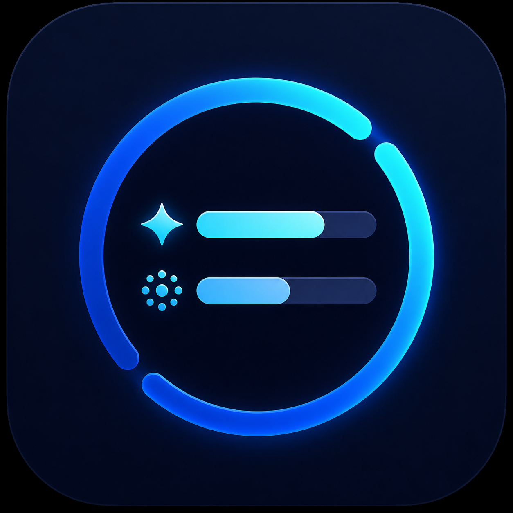
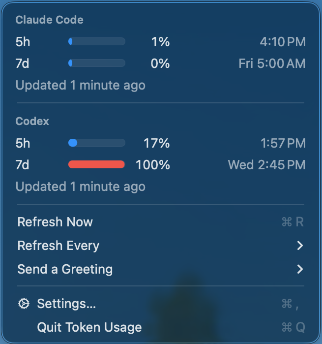

# MacOS Token Usage Menu

A personal macOS menu-bar app that shows your Claude Code and Codex CLI **subscription usage** — percent used and reset time for each rate-limit window. It reads data your existing logins already produce locally. No API keys, no HTTP calls, no credential access.



## Requirements

| | |
|---|---|
| macOS | 13.0 or later |
| Xcode | 16.3 or later (the project uses `objectVersion = 71`) |
| Codex CLI | optional — needed for the Codex section, logged in via `codex login` |
| Claude Code | optional — needed for the Claude section, plus the status-line helper below |

Both providers are optional. Turn either off in **Settings…** and it is never read or queried.

## Quick start

```sh
git clone <your-fork-url> && cd status-bar

# Claude section: install the status-line helper and wire up settings.json
./Support/install-claude-statusline.sh

# Codex section: log in once
codex login
```

Then open `AIUsageMenu.xcodeproj` in Xcode and press **Run**. Click the chart icon in the menu bar.

The app refreshes on launch, every five minutes, and whenever you choose **Refresh**. Each row shows percent used and its reset time. If a provider is unavailable, its section shows a short message and keeps the last successful reading.

## Claude setup

Claude Code has no local usage file to read, so the app gets its data from a **status line** helper: Claude Code pipes a JSON payload to your status-line command on every turn, and the helper saves it where the app can read it.

### Automatic

```sh
./Support/install-claude-statusline.sh
```

The script:

1. Copies `Support/claude-statusline.sh` to `~/.claude/ai-usage-statusline.sh` and makes it executable.
2. Sets `statusLine` in `~/.claude/settings.json`, preserving everything else in the file.

It is idempotent — re-running it when already installed changes nothing. If you already have a *different* `statusLine` command it stops rather than clobbering it; pass `--force` to replace it anyway. Either way a timestamped `settings.json.bak.*` is written before any edit.

### Manual

If you would rather not run the script:

```sh
cp Support/claude-statusline.sh ~/.claude/ai-usage-statusline.sh
chmod +x ~/.claude/ai-usage-statusline.sh
```

Then merge this into `~/.claude/settings.json`:

```json
{ "statusLine": { "type": "command", "command": "~/.claude/ai-usage-statusline.sh" } }
```

### Either way

Send one Claude Code request afterwards. Until a request completes, the app has nothing to read and shows *"Claude setup required or no Claude session has produced data yet."*

Already have a status line you want to keep? The helper reads stdin and prints its own label, so chain it from your own script:

```sh
payload="$(cat)"
printf '%s' "$payload" | ~/.claude/ai-usage-statusline.sh > /dev/null
printf '%s' "$payload" | your-existing-statusline
```

## Codex setup

```sh
codex login
```

The app runs `codex app-server --stdio` and asks it for `account/rateLimits/read`. It looks for the `codex` binary on `PATH`, then in `~/.local/bin`, `/opt/homebrew/bin`, and `/usr/local/bin`, and finally by asking your login shell (`zsh -lc 'command -v codex'`). Requests time out after 10 seconds.

## Install a local app build

You do not need to launch from Xcode every time.

1. Open `AIUsageMenu.xcodeproj`.
2. **Product > Build**.
3. In the project navigator, open **Products**, right-click `AIUsageMenu.app`, choose **Show in Finder**.
4. Copy `AIUsageMenu.app` to `/Applications`.
5. Launch it. It appears in the menu bar as a chart icon — there is no Dock icon (`LSUIElement`).

To launch it from Shortcuts, create a shortcut with the **Open App** action and choose `AIUsageMenu`.

### Signing

The project uses automatic signing with **no development team set**, so the first build on a new machine may ask you to pick one. In Xcode: select the `AIUsageMenu` target, open **Signing & Capabilities**, and choose your team — or "Sign to Run Locally" if you have no Apple developer account. You may also want to change `PRODUCT_BUNDLE_IDENTIFIER` from `com.zhuy9.AIUsageMenu` to your own reverse-DNS identifier.

The app is intentionally **not sandboxed**: it launches `codex` and reads `~/Library/Application Support/`, neither of which a sandboxed app can do.

A local development build is fine for your own Mac. Sharing the binary with other people needs a signed and notarized build.

### Command line

```sh
xcodebuild -project AIUsageMenu.xcodeproj -scheme AIUsageMenu build
xcodebuild -project AIUsageMenu.xcodeproj -scheme AIUsageMenu test
```

## Troubleshooting

| Message | Cause | Fix |
|---|---|---|
| "Codex CLI not found." | `codex` is not on `PATH` or in the standard locations | Install Codex CLI, or symlink it into `/usr/local/bin` |
| "Codex is not logged in. Run codex login." | The app-server returned an error | `codex login` |
| "Codex usage request timed out." | `codex app-server` did not answer within 10s | Run `codex app-server --stdio` by hand to see what it does |
| "Claude setup required or no Claude session has produced data yet." | Helper not installed, or no turn has completed | Run the installer, then send one Claude request |
| "Send one Claude request to populate subscription usage." | Payload arrived but had no `rate_limits` | Complete a real Claude Code turn |
| "Claude usage file could not be read." | `claude-status.json` is truncated or not JSON | Delete `~/Library/Application Support/AIUsage/claude-status.json` and send another request |

A failed refresh never wipes a good reading — the last successful value stays on screen next to the message.

## Privacy and data

The app makes **no network requests**. It never touches Keychain, credentials, browser data, prompts, or transcript contents.

Everything it stores lives in `~/Library/Application Support/AIUsage/` (created `0700`):

| File | Written by | Contents |
|---|---|---|
| `claude-status.json` | the status-line helper (`0600`) | The raw Claude Code status-line payload. The app reads only `rate_limits` and the file's modification date — but note the payload as written also carries fields such as the current working directory, session id, model name, and the *path to* (not the contents of) your transcript. |
| `codex-cache.json` | the app (`0600`) | Normalized Codex percentages and reset times only. |

Provider on/off toggles are stored in `UserDefaults`.

To remove everything:

```sh
rm -rf "$HOME/Library/Application Support/AIUsage"
rm -f "$HOME/.claude/ai-usage-statusline.sh"
# then delete the "statusLine" key from ~/.claude/settings.json
```

## Non-goals

No API billing or cost tracking, multiple accounts, history, charts, alerts, background service, login item, automatic updates, browser scraping, or App Store packaging.

## License

MIT — see [LICENSE](LICENSE).
